# Module 5

---
## Contents
1. **Project Set Up**
    - [Screenshots](#project-set-up)
2. **Performance Testing**
    - [All Students](#all-students)
    - [All Student names](#all-student-names)
    - [Highest GPA](#highest-gpa)
3. **Profiling**
   - [All Students](#opt-all-students)
   - [All Student names](#opt-all-student-names)
   - [Highest GPA](#opt-highest-gpa)
4. **MODULE 5**
    - [Reflection](#reflection-module-05)
---

## Project Set Up

| Seed 1          | Seed 2              | SQL                 |
|-----------------|---------------------|---------------------|
| 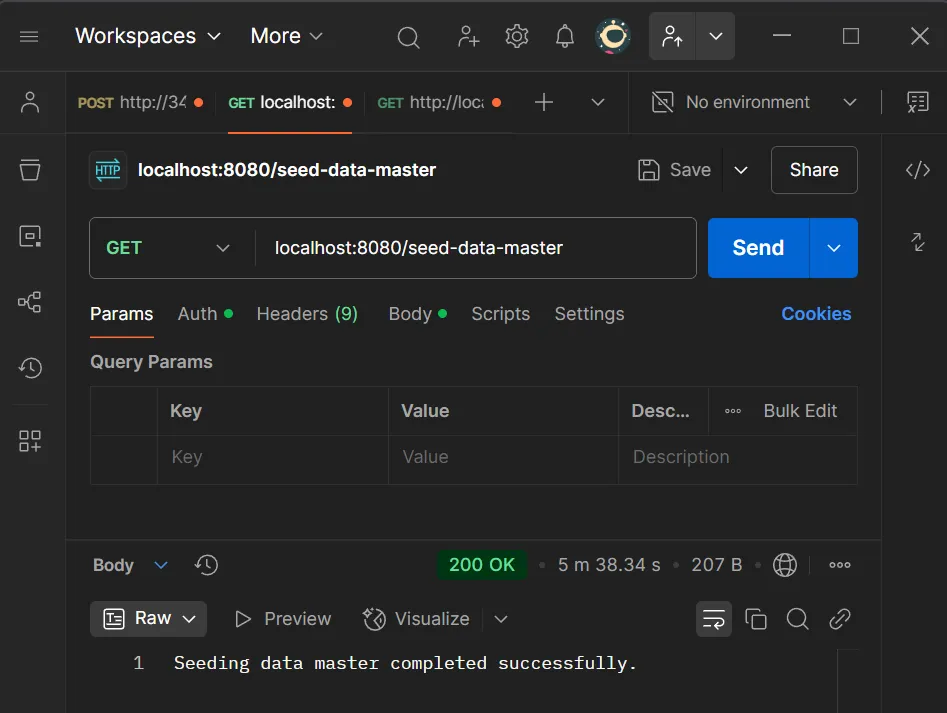 | 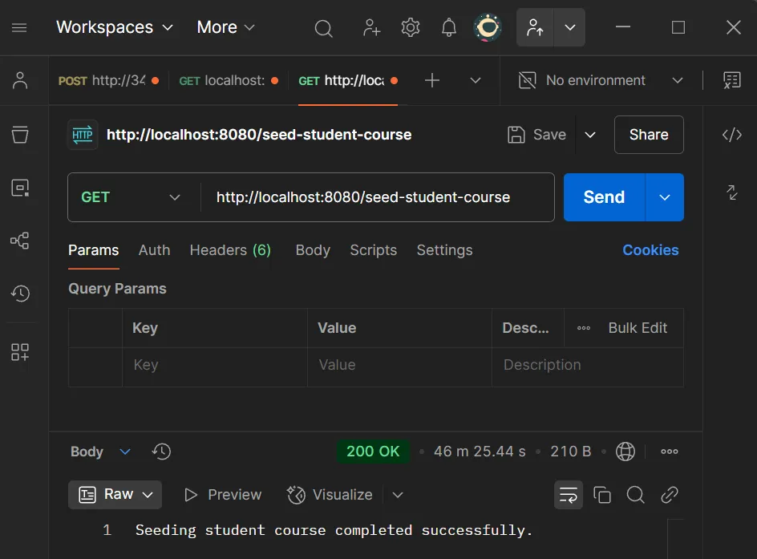 | 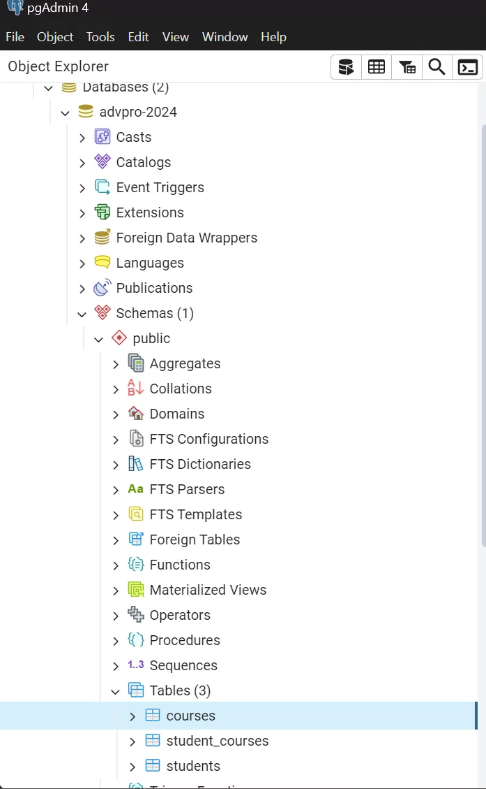 |

## Performance Testing

### All Students

| Summary                 | View Results            |
|-------------------------|-------------------------|
| 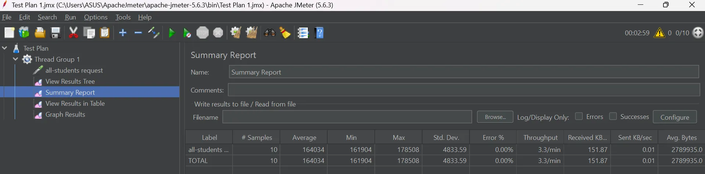 | 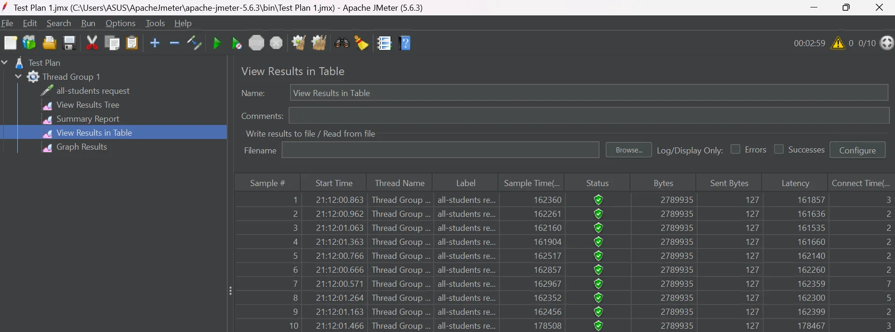 |

| Graph                   | Jlt Logs                |
|-------------------------|-------------------------|
| 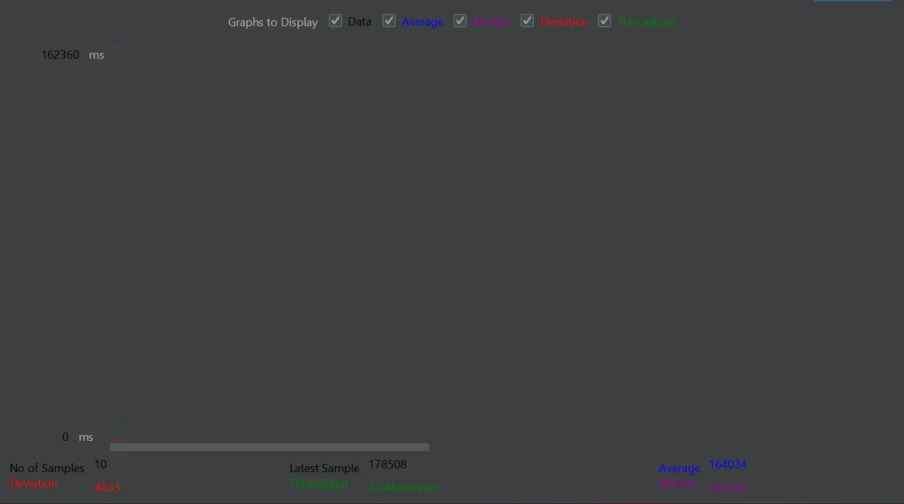 | 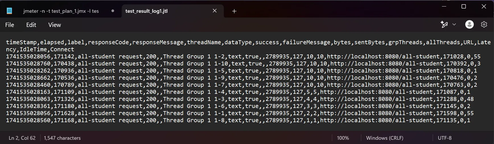 |

### All Student Names

| Summary                 | View Results            |
|-------------------------|-------------------------|
| 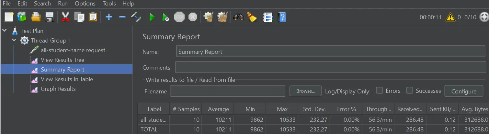 | 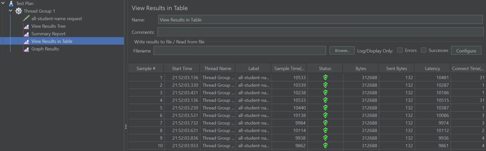 |

| Graph                   | Jlt Logs                |
|-------------------------|-------------------------|
| 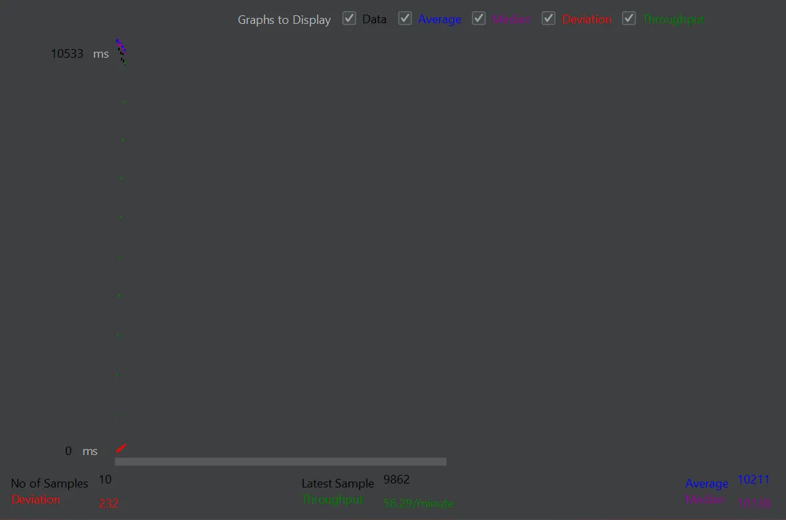 | 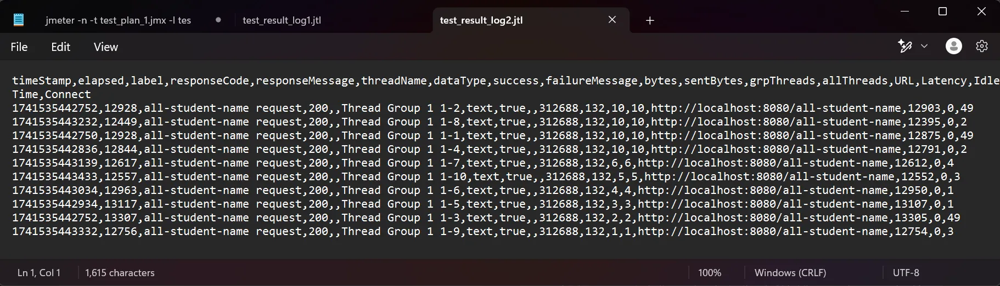 |

### Highest GPA

| Summary                 | View Results            |
|-------------------------|-------------------------|
| 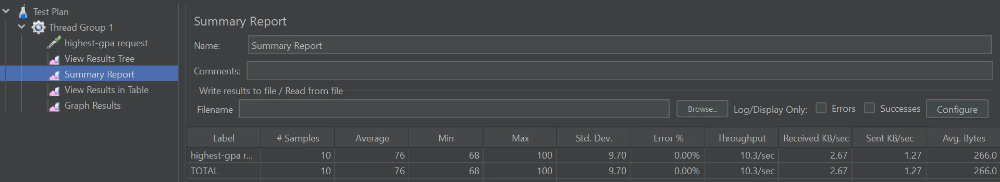 | 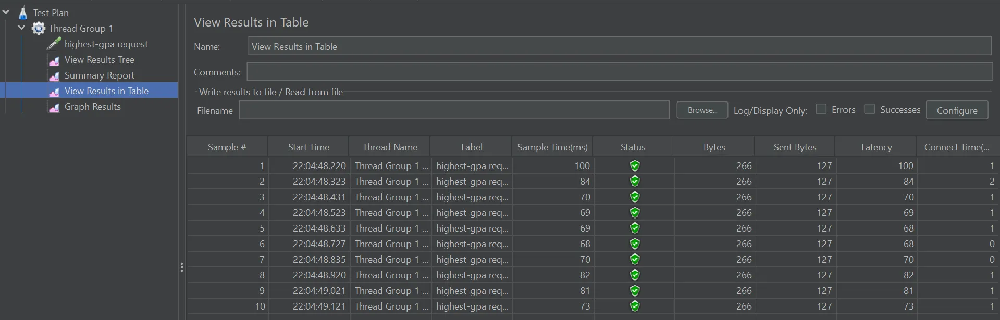 |

| Graph                   | Jlt Logs                |
|-------------------------|-------------------------|
| 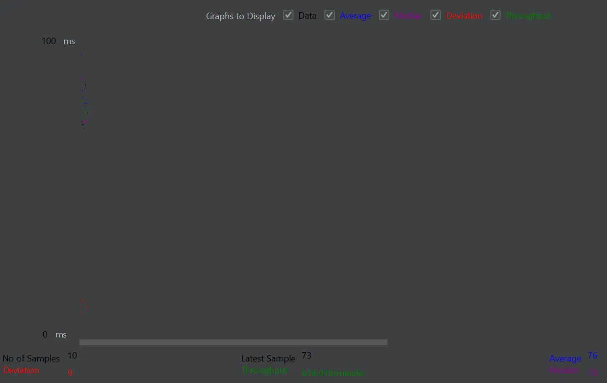 | |

## Profiling

### Opt All Students

| Before | After |
|--------|-------|
| ..     | ..    |

### Opt All Student Names

| Before | After |
|--------|-------|
| ..     | ..    |

### Opt Highest GPA

| Before | After |
|--------|-------|
| ..     | ..    |

## Reflection Module 05

>What is the difference between the approach of performance testing with JMeter and profiling with IntelliJ Profiler in the context of optimizing application performance?

JMeter tests system-wide performance under load by simulating multiple users, measuring response times and throughput, while IntelliJ Profiler analyzes code-level performance, identifying CPU-intensive methods, memory leaks, and inefficient threading. JMeter shows what is slow, whereas profiling explains why it's slow.

>How does the profiling process help you in identifying and understanding the weak points in your application?

Profiling reveals inefficient code by analyzing CPU usage, memory allocation, and thread behavior. Tools like flame graphs and call trees pinpoint performance hotspots, helping developers optimize critical code paths, reduce memory waste, and improve execution speed.

>Do you think IntelliJ Profiler is effective in assisting you to analyze and identify bottlenecks in your application code?

IntelliJ Profiler effectively detects bottlenecks by visualizing execution time, memory usage, and thread activity. Features like flame graphs and call trees highlight inefficiencies, making it easier to optimize performance and reduce resource consumption.

>What are the main challenges you face when conducting performance testing and profiling, and how do you overcome these challenges?

Challenges include variable test results, profiler overhead, and data complexity. Solutions involve controlled test environments, using sampling-based profiling to reduce overhead, and filtering profiler data to focus on critical issues.

>What are the main benefits you gain from using IntelliJ Profiler for profiling your application code?

Some key benefits include:

* Granular Performance Insights: Identifies specific methods, loops, and code blocks consuming excessive resources.
* Memory Leak Detection: Helps track down objects that are not getting garbage collected, preventing memory bloat.
* Thread Analysis: Detects concurrency issues like deadlocks and race conditions.
* Code Optimization Guidance: Provides concrete data on where to refactor code for better performance.
* Comparison of Profiling Sessions: Allows us to compare pre- and post-optimization performance to measure the effectiveness of changes.

>How do you handle situations where the results from profiling with IntelliJ Profiler are not entirely consistent with findings from performance testing using JMeter?

Differences arise due to network latency, database interactions, and profiler overhead. We reconcile them by profiling under load, cross-validating with other tools, and ensuring tests reflect real-world scenarios.

>What strategies do you implement in optimizing application code after analyzing results from performance testing and profiling? How do you ensure the changes you make do not affect the application's functionality?

We optimize hot code paths, reduce memory usage, and improve concurrency while ensuring correctness via unit tests, profiling comparisons, and staged rollouts to maintain stability and performance.

* Optimizing Hot Code Paths: Refactoring methods that take up the most CPU time, such as replacing inefficient loops with optimized algorithms.
* Reducing Memory Usage: Using StringBuilder instead of String concatenation, reducing object instantiations, and leveraging object pooling where applicable.
* Enhancing Concurrency: Optimizing thread synchronization mechanisms to reduce contention and improve parallel execution.
* Minimizing I/O Overhead: Reducing database calls, caching frequently accessed data, and using batch processing for network requests.
* Tuning JVM Parameters: Adjusting heap size, garbage collection settings, and thread pool configurations based on profiling insights.
