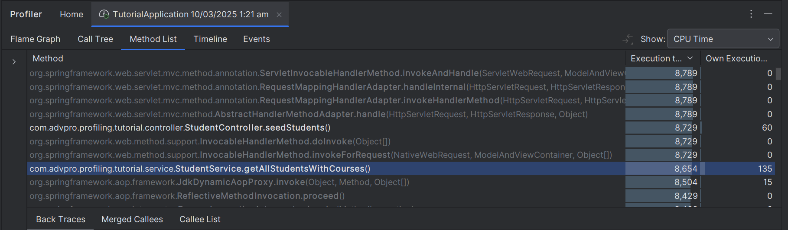
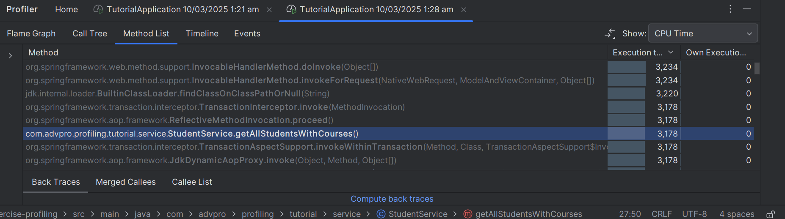
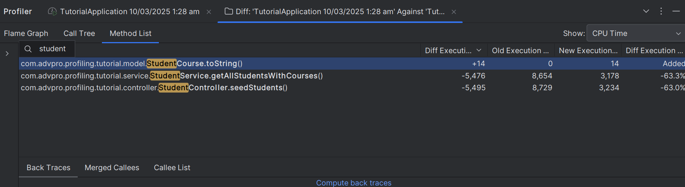

# Module 5

---
## Contents
1. **Project Set Up**
    - [Screenshots](#project-set-up)
2. **Performance Testing**
    - [All Students](#all-students)
    - [All Student names](#all-student-names)
    - [Highest GPA](#highest-gpa)
3. **Profiling**
   - [All Students](#opt-all-students)
   - [All Student names](#opt-all-student-names)
   - [Highest GPA](#opt-highest-gpa)
4. **MODULE 5**
    - [Reflection](#reflection-module-05)
---

## Project Set Up

| Seed 1          | Seed 2              | SQL                 |
|-----------------|---------------------|---------------------|
|  |  |  |

## Performance Testing

### All Students

| Summary                 | View Results            |
|-------------------------|-------------------------|
|  |  |

| Graph                   | Jlt Logs                |
|-------------------------|-------------------------|
|  |  |

### All Student Names

| Summary                 | View Results            |
|-------------------------|-------------------------|
|  |  |

| Graph                   | Jlt Logs                |
|-------------------------|-------------------------|
|  |  |

### Highest GPA

| Summary                 | View Results            |
|-------------------------|-------------------------|
|  |  |

| Graph                   | Jlt Logs                |
|-------------------------|-------------------------|
|  | |

## Profiling

### Opt All Students

| Before | After |
|--------|-------|
| ||

| Conclusion                |
|---------------------------|
|  |

### Opt All Student Names

| Before | After |
|--------|-------|
| ..     | ..    |

### Opt Highest GPA

| Before | After |
|--------|-------|
| ..     | ..    |

## Reflection Module 05

>What is the difference between the approach of performance testing with JMeter and profiling with IntelliJ Profiler in the context of optimizing application performance?

Performance testing with JMeter and profiling with IntelliJ Profiler serve distinct but complementary roles in optimizing application performance. JMeter focuses on testing the application under various load conditions by simulating multiple users, measuring response times, throughput, and overall system behavior under stress. It helps identify bottlenecks at a system level, such as slow database queries or inefficient load balancing.

On the other hand, profiling with IntelliJ Profiler provides a more granular analysis at the code level. It helps in identifying CPU-intensive methods, memory leaks, inefficient thread usage, and other internal inefficiencies. While JMeter tells us what part of the application is slow, IntelliJ Profiler helps us understand why it is slow by providing insights into execution time, memory allocation, and method call hierarchies.

>How does the profiling process help you in identifying and understanding the weak points in your application?

Profiling helps in pinpointing performance bottlenecks by collecting runtime data, such as CPU usage, memory allocation, and thread behavior. By analyzing profiling outputs like flame graphs, call trees, and timeline views, we can identify methods consuming excessive CPU time, locate memory leaks, and detect inefficient object instantiations. This level of detail allows us to target specific optimizations rather than making blind performance enhancements.

For example, if a profiler shows that a method responsible for sorting data is taking a significant amount of CPU time, we might consider optimizing it using a more efficient sorting algorithm or reducing redundant computations. Without profiling, such inefficiencies might remain hidden despite performance testing results showing slow response times.

>Do you think IntelliJ Profiler is effective in assisting you to analyze and identify bottlenecks in your application code?

Yes, IntelliJ Profiler is highly effective for analyzing and identifying bottlenecks within application code. It provides detailed insights into execution time at the method level, memory usage patterns, garbage collection behavior, and thread synchronization issues. Features such as flame graphs, call trees, and real-time profiling make it easier to visualize performance issues.

However, its effectiveness depends on how well the profiling results are interpreted. If used correctly, it helps developers make data-driven optimizations rather than guessing where performance issues might exist. Additionally, IntelliJ Profiler integrates seamlessly with the development environment, making it convenient to analyze performance bottlenecks without switching between tools.

>What are the main challenges you face when conducting performance testing and profiling, and how do you overcome these challenges?

Challenges include 
* High Variability in Results: Performance testing results may fluctuate due to external factors such as network latency or varying system loads. To overcome this, we ensure tests are conducted in a controlled environment and repeated multiple times for consistency.
* Overhead of Profiling: Running a profiler can introduce performance overhead, affecting real-time execution. To mitigate this, we use sampling-based profiling instead of instrumentation-based profiling where possible.
* Interpreting Data Correctly: Large profiling datasets can be overwhelming. We address this by focusing on hotspots (methods with high execution time) and using filtering techniques to isolate relevant data.
Ensuring Profiling Reflects Real-world Scenarios: Profiling a locally running application might not always reflect production conditions. We counter this by profiling under load, simulating real-world usage with tools like JMeter while running the profiler.

>What are the main benefits you gain from using IntelliJ Profiler for profiling your application code?

Some key benefits include:

* Granular Performance Insights: Identifies specific methods, loops, and code blocks consuming excessive resources.
* Memory Leak Detection: Helps track down objects that are not getting garbage collected, preventing memory bloat.
* Thread Analysis: Detects concurrency issues like deadlocks and race conditions.
* Code Optimization Guidance: Provides concrete data on where to refactor code for better performance.
* Comparison of Profiling Sessions: Allows us to compare pre- and post-optimization performance to measure the effectiveness of changes.

>How do you handle situations where the results from profiling with IntelliJ Profiler are not entirely consistent with findings from performance testing using JMeter?

Differences arise due to network latency, database interactions, and profiler overhead. We reconcile them by profiling under load, cross-validating with other tools, and ensuring tests reflect real-world scenarios.

>What strategies do you implement in optimizing application code after analyzing results from performance testing and profiling? How do you ensure the changes you make do not affect the application's functionality?

We optimize hot code paths, reduce memory usage, and improve concurrency while ensuring correctness via unit tests, profiling comparisons, and staged rollouts to maintain stability and performance.

* Optimizing Hot Code Paths: Refactoring methods that take up the most CPU time, such as replacing inefficient loops with optimized algorithms.
* Reducing Memory Usage: Using StringBuilder instead of String concatenation, reducing object instantiations, and leveraging object pooling where applicable.
* Enhancing Concurrency: Optimizing thread synchronization mechanisms to reduce contention and improve parallel execution.
* Minimizing I/O Overhead: Reducing database calls, caching frequently accessed data, and using batch processing for network requests.
* Tuning JVM Parameters: Adjusting heap size, garbage collection settings, and thread pool configurations based on profiling insights.
